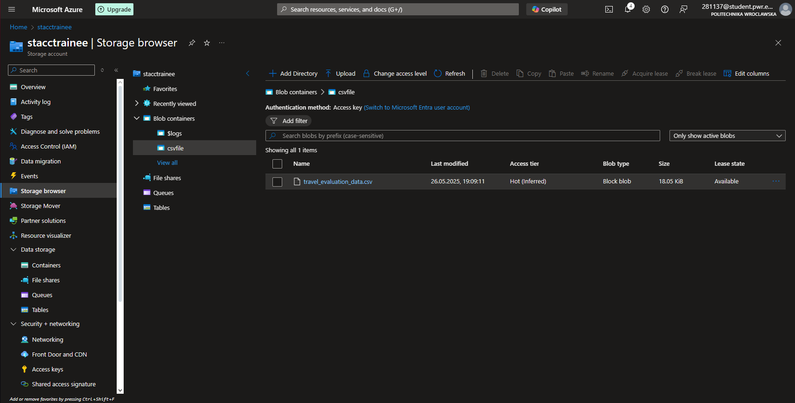

# AI academy
This repository is dedicated to documenting and completing tasks assigned as part of the **AI Academy training program**.

## Day 1
**Task:**
Create your GitHub repository and get familiar with tool (repo, commits, pull request, merge)
Create a python project with src-layout and put it inside Git repository.

**Execution:**
Created this repo. Created the src-layout project structure and comitted the changes,then pushed. Created a branch and merged.

## Day 2
**Task:**
Create Azure subscription, first resoucre group use Bicep skeleton for an RG + Key Vault, tweak & deploy it,
then commit the .bicep file and a portal screenshot.
**Execution:**
Created azure subscription. Then used bicep skeleton to create resource group and Key vault. Then deployed.

## Day 3
**Task:**
Deploy gpt-4o, run three prompts, and log prompt / tokens in & out / cost to /logs/usage.md; note which prompt is most efficient. Create code that will execute those prompts from Python.
**Execution:**
Link to code: [code](src/openai/test.py)

## Day 4
**Task:**
Craft an quiz-bot prompt, save it to /prompts/best.txt, and leave a tweak suggestion on one peer’s prompt. Create game in Python that you will be show during our meeting (Day 7). Command line game is enough.
**Execution:**
I created a Python-based quiz game inspired by the popular Polish TV show Postaw na milion ("Bet for a Million"). The game dynamically generates interesting and thought-provoking multiple-choice questions in Polish, making each playthrough unique.
Link to code: [code](src/quiz_bot/quiz_bot.py)
